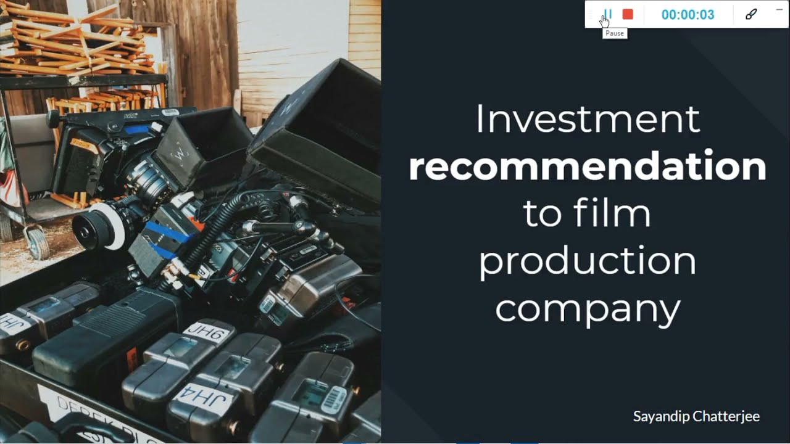
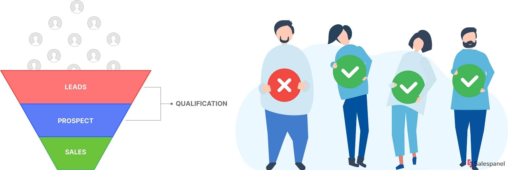

# Data Science Portfolio
---
## Data Analysis & Machine learning projects
---
### Sales Forecating for Rossman Drug Distribution

Rossmann is a European drug distributor which operates over 3,000 drug stores across seven European countries. Since a lot of drugs come with a short shelf life, that is, they do not have a long expiry date, it becomes imperative for Rossmann to accurately forecast sales at their individual stores. Currently, the forecasting is taken care of by the store managers who are tasked with forecasting daily sales for the next six weeks. 

As expected, store sales are influenced by many factors, including promotional campaigns, competition, state holidays, seasonality, and locality.

With thousands of individual managers predicting sales based on their unique circumstances and intuitions, the accuracy of the forecasts is quite varied. To overcome this problem, we are tasked to work on the forecasting problem. As part of this project, we will be building a forecasting model to forecast the daily sales for the next six weeks.

---
### Movie production recommendation using SQL

Using SQL & IMDB data, I have tried to recommend the genre, cast & crew to bring on board to produce an international movie which can become a biggest grocers.

If a production company wants to plan their every move analytically based on data then they can use this sort of approach. I have used the movie data from the IMDB website to analyse the movies that have been released in the past three years. I have analysed the data set and drew meaningful insights that can help any production company to start a new successful project. 

---
### Demand Analysis for a Bike Sharing App

Using this case-study I had built a multiple linear regression model for the prediction of demand for shared bikes. This model is built in python using the scikit learn library.

This helps in understanding the demand for shared bikes with the available independent variables. It will be used by the management to understand how exactly the demands vary with different features. They can accordingly manipulate the business strategy to meet the demand levels and meet the customer's expectations. Further, the model will be a good way for management to understand the demand dynamics of a new market.

---
### Lead Quality Assesment of an Edtech Organization

This case study is based on an ed-tech company. They are trying to maximise their efforts on lead conversion where they want to spend more energy & resources on higly potential leads instaed giving focus to all leads.

In order to help the company we have used their previous year data and implemented a machine learning model - Logistic Regression to calculate the scores of the leads. Suppofe if the lead has a higher score, that means that they are more like to purchase a course from them.

---

### Loan Eligibility Assesment - Bank Case Study

This case study aims to give you an idea of applying EDA in a real business scenario. In this case study, apart from applying the EDA techniques, I have also implemented a few basic risk analytics in banking and financial services and understand how data is used to minimize the risk of losing money while lending to customers.

